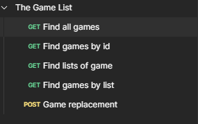
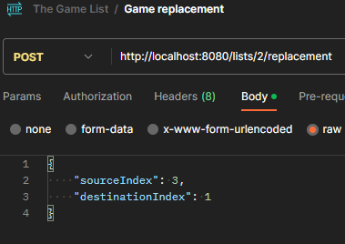
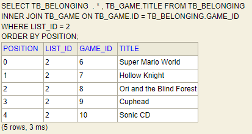
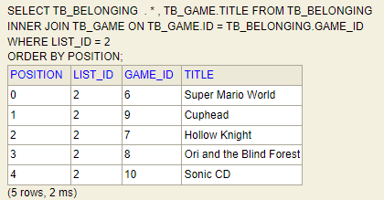
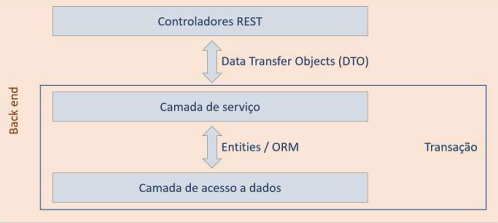
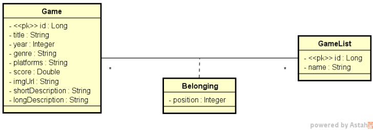

<h1 align= "center">Top Game List 🎮</h1>  
 
## About the Project
The Game List consists of a backend application with Spring Boot and SQL database. Built by the professor, Nelio Alves during a Java and Spring Boot immersion, event organized by DevSuperior. 

In the project there are two lists of games, one of adventure and RPG and the other of platform games. Through these lists with HTTP GET requests you can see the lists of games, games specified by their id, all the games and the games in each list.

Also, with the POST method you can change the position of the game in the list by updating this list automatically in the SQL database. This method is done via SQL query using nativeQuery, so you needed to use projections to access the data with Spring Data JPA. The entities are all transferred with DTO (Data Transfer Object) to have control over the data that is transferred and also to have the correct separation of responsibility.

 

### HTTP methods used

  

 

### Repositioning games from the list

- <strong>  Requisition names  </strong>

  

 

- <strong>  List before of replacement  </strong>

  

 

- <strong>  List after of replacement  </strong>

  

 

## Layer Pattern

  

 

## Domain model

  

 

## Technologies used
- Java
- Spring Boot
- Maven
- JPA/HIBERNATE
- Postman
- H2 database
- PostgreSQL

## Final considerations - what have I learned?
This project reinforced my knowledge of Layer Patterns, REST API's, DTO project pattern usage, business rules relating to data in the database, as for example updating the order of a list through an HTTP method and also the creation of different environments with their own settings like the test profile using the h2 in-memory database and the homologation profile using PostgreSQL. 

In addition, the Professor Nélio Alves used Docker compose to lift containers from the PostgreSQL DBMS server and pgAdmin which makes the process much easier and there is no need to manually install and configure the DBMS and database on the operating system. This was the first time I saw the use of Docker in a project and opened my mind to search and study more about containerization. And finally I also learned how to use Railway to deploy in the cloud and have a CI/CD wake of the project and using CORS to control resource requests between different domains.

I had difficulties to understand Docker compose configurations and also about the logic to move the order of the game in the list and update directly in the database, but this makes me more willing to learn, search for information and alternatives to do the same thing in a different way, such as using containerization to work with database and other tools instead of doing it avoiding the direct installation of these tools on the local system.  

## Support resources and creator mention

- PDF's do projeto:
|[PDF1](https://drive.google.com/file/d/1K-RfCdns7bsipwba1wFUeCBRTPqdxRi8/view?usp=sharing)| 
|[PDF2](https://drive.google.com/file/d/1QVTWD32CeYb5zu2KB8dgwvQC5UNDkGXe/view?usp=sharing)| 
|[PDF3](https://drive.google.com/file/d/1ujGQCgoLLn5WlZWM558F7D7nI7iy03iL/view?usp=sharing)| 

- Creator of project: [Nélio Alves](https://github.com/acenelio), [DevSuperior](https://github.com/devsuperior)

  
